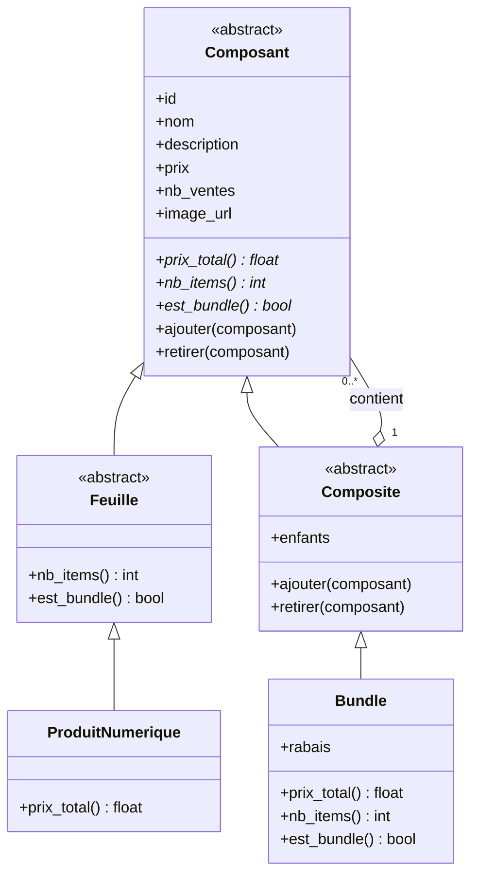

```mermaid
classDiagram
    class Composant {
        <<abstract>>
        +id
        +nom
        +description
        +prix
        +nb_ventes
        +image_url
        +prix_total()* float
        +nb_items()* int
        +est_bundle()* bool
        +ajouter(composant)
        +retirer(composant)
    }

    class Feuille {
        <<abstract>>
        +nb_items() int
        +est_bundle() bool
    }

    class Composite {
        <<abstract>>
        +enfants
        +ajouter(composant)
        +retirer(composant)
    }

    class ProduitNumerique {
        +prix_total() float
    }

    class Bundle {
        +rabais
        +prix_total() float
        +nb_items() int
        +est_bundle() bool
    }

    Composant <|-- Feuille
    Composant <|-- Composite
    Feuille <|-- ProduitNumerique
    Composite <|-- Bundle
    Composite "1" o-- "0..*" Composant : contient
```