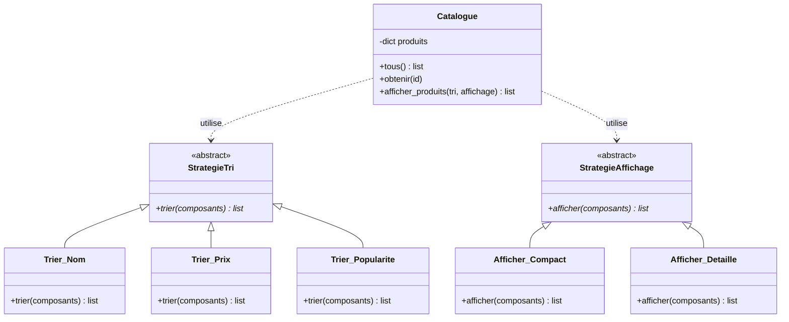

```mermaid
classDiagram
    class Catalogue {
        -dict produits
        +tous() list
        +obtenir(id)
        +afficher_produits(tri, affichage) list
    }

    class StrategieTri {
        <<abstract>>
        +trier(composants)* list
    }

    class StrategieAffichage {
        <<abstract>>
        +afficher(composants)* list
    }

    class Trier_Nom {
        +trier(composants) list
    }

    class Trier_Prix {
        +trier(composants) list
    }

    class Trier_Popularite {
        +trier(composants) list
    }

    class Afficher_Compact {
        +afficher(composants) list
    }

    class Afficher_Detaille {
        +afficher(composants) list
    }

    StrategieTri <|-- Trier_Nom
    StrategieTri <|-- Trier_Prix
    StrategieTri <|-- Trier_Popularite

    StrategieAffichage <|-- Afficher_Compact
    StrategieAffichage <|-- Afficher_Detaille

    Catalogue ..> StrategieTri : utilise
    Catalogue ..> StrategieAffichage : utilise
```